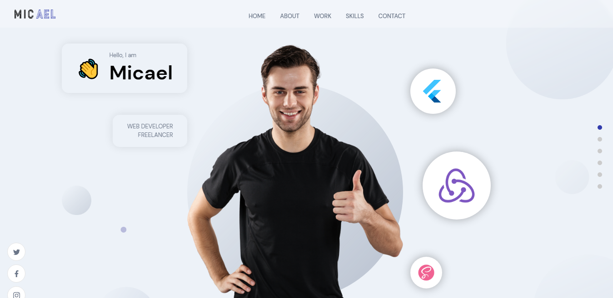
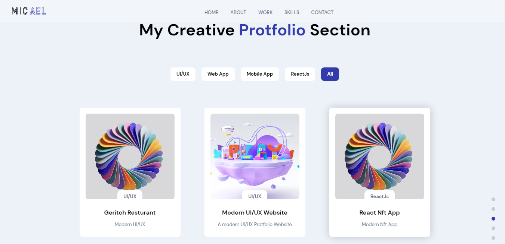
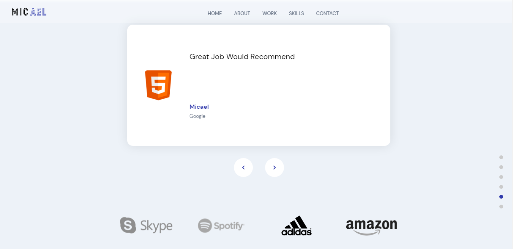
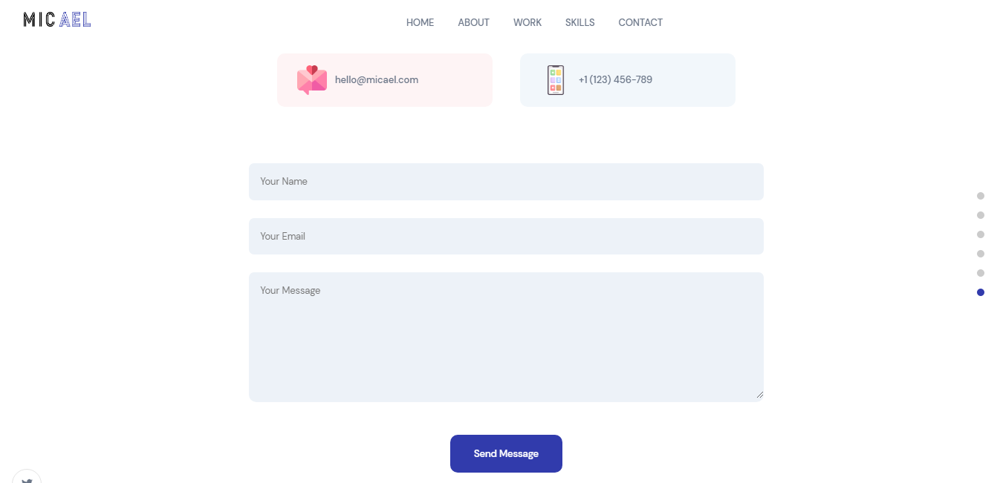
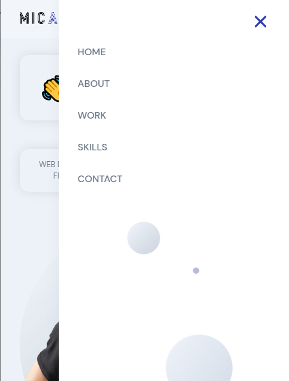
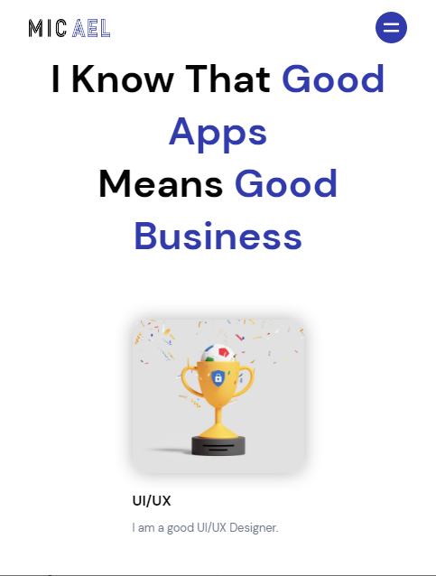
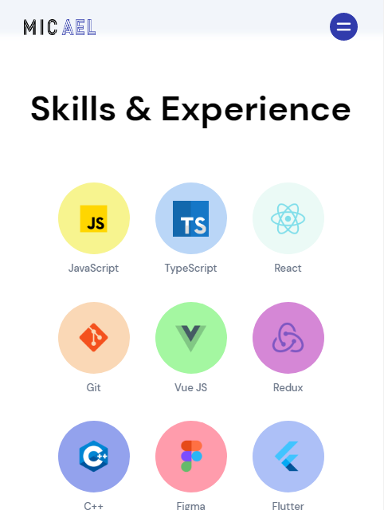

### Portfolio Web App

### :link: https://protfolio-web.netlify.app//

### Learned from : [JavaScript Mastery](https://youtu.be/3HNyXCPDQ7Q)

## Images

## Mobile Responsive

## Run Locally

- Run this command `git clone https://github.com/aliaftabsheikh/Protfolio-web.git`
- You are now in the dev environment and you can play around

## Tech Stack

- HTML5
- CSS3
- Javascript
- React js
- Sanity
- Framer Motion
- Netlify

## How we Learn

- React Functional components and their reusability
- React file and folder structure
- Fundamental CSS properties to master flex & grid
- Fundamentals of the CSS BEM Model
- From soft and pleasant animations with Framer Motion
- Sanity usage to get and insert data
- And at the end we will learn how to deploy your websites at Netlify
